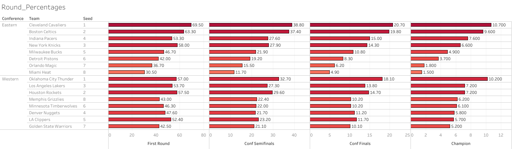
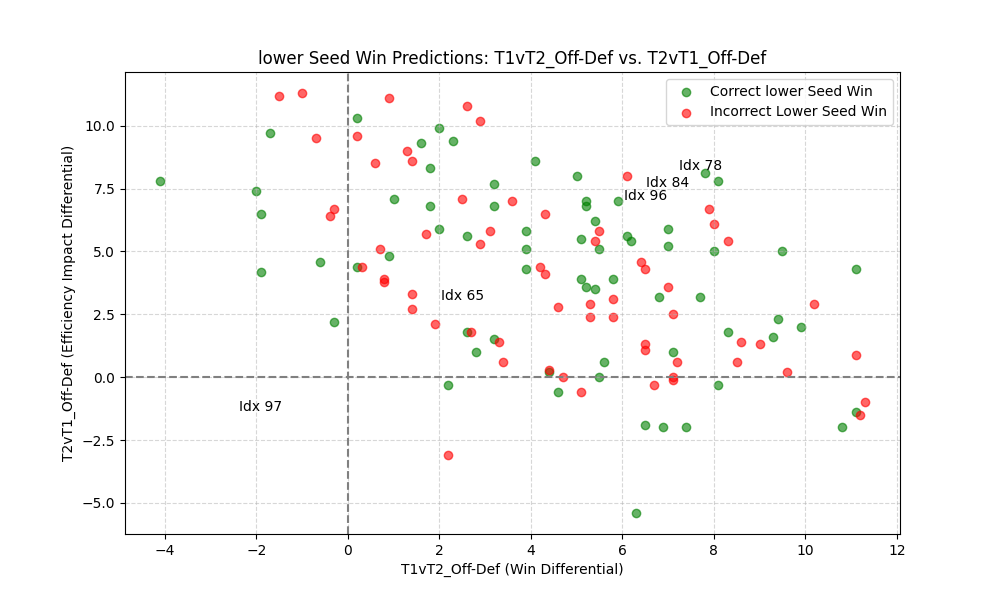
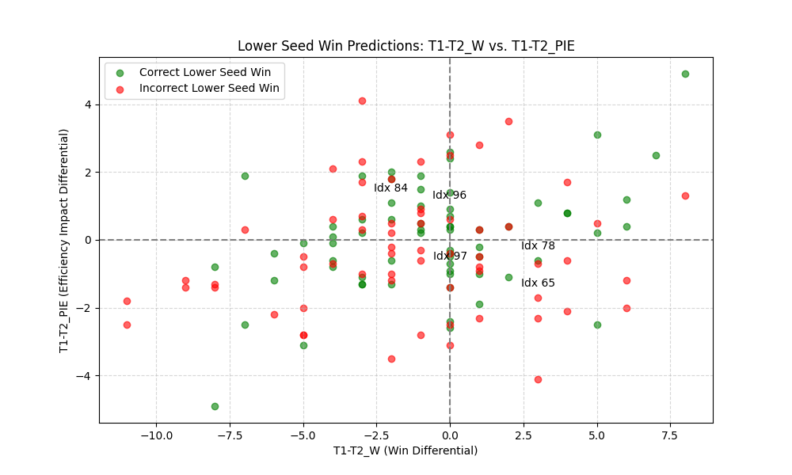
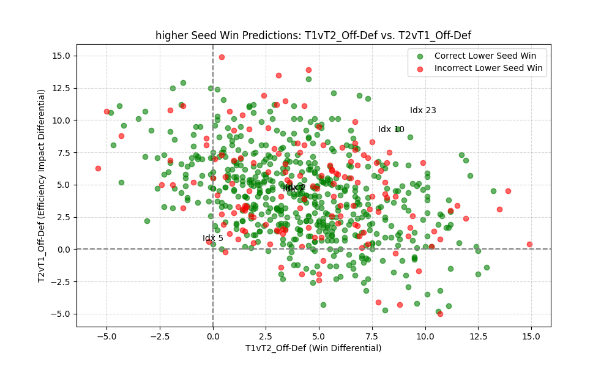
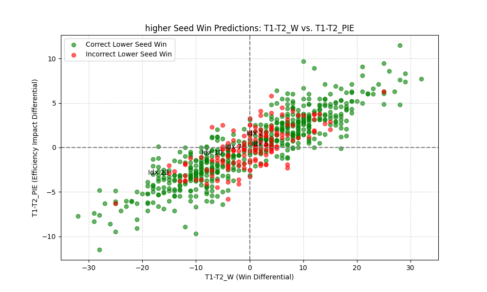

# NBA Playoff Predictor: Results Showcase

## Overview
This document highlights key results and visualizations, complementing the technical details in the [README](README.md).

## Key Results
- **Model Performance**: The neural network, implemented in TensorFlow (`NBA_Playoff_NN.h5`), achieved 73-74% accuracy on test data, correctly predicting series outcomes for the 2025 playoff bracket.
- **2025 Predictions**: For the 2025 playoffs, the model generated series win probabilities, detailed in `2025_Round_Percentages`.

## Visualizations
Below are key visualizations created to interpret the model’s predictions and insights, built using Tableau and Python.

### 2025 Round Percentages (Main Results):
This visual illustrates each teams chances of advancing past each playoff round of the 2025 NBA playoffs.

### Lower Seed Win Predictions
The plots below showcase the models success at predicting lower seed wins (upsets). Each dot represents an individual playoff series in which the model predicts an upset (green = correct prediction, red = incorrect prediction). The purpose of the plots are to try to identify the pattern the model follows in predicting upsets. 
Note: T1vT2_Off-Def and T2vT1_Off-Def compare the differences between one team's offensive rating vs the other team's defensive rating. T1-T2_W and T1-T2_PIE represents the difference in wins and PIE (PIE's full description found at https://www.nba.com/stats/help/faq) between the two teams. All four metrics are features in the model.

Take Aways: Difficult to identify any pattern as the distribution of green and red dots appear evenly distributed, however there are some signs of green and red dots clustered together which may not be coincidence. There is not enough data to form any concrete conclusions

Take Aways: Difficult to identify any pattern as the distribution of green and red dots appear evenly distributed.

### Higher Seed Win Predictions
The plots below showcase the models success at predicting higher seed wins (non upsets). Each dot represents an individual playoff series in which the model predicts an upset (green = correct prediction, red = incorrect prediction). The purpose of the plots are to try to identify the pattern the model follows in predicting non upsets. 
Note: T1vT2_Off-Def and T2vT1_Off-Def compare the differences between one team's offensive rating vs the other team's defensive rating. T1-T2_W and T1-T2_PIE represents the difference in wins and PIE (Player Impact Efficiency) between the two teams. All four metrics are features in the model.

Take Aways: Again the distribution of red dots are relatively evenly spaced through the the sea of green dots, thus making it difficult to form any conclusions. However, there again appears to be some manner of clustering of red and green dots seperately in specific regions of the plot.

Take Aways: The model is very succesful at predicting non upsets when the difference in PIE and W's between the two teams are greater since in both the x and y plane the red dots are congregated centrally. This is to be expected as in general 

