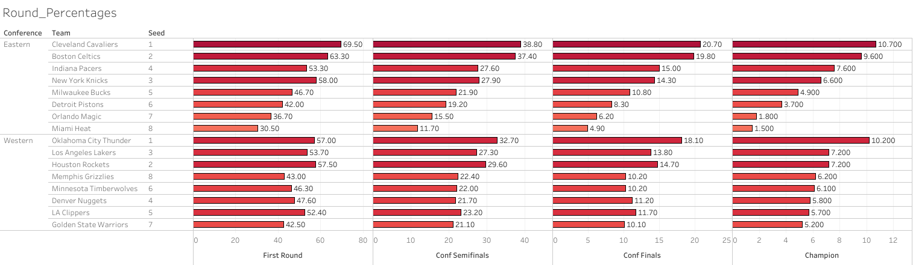

# NBA Playoff Predictor: Results Showcase

## Overview
The NBA Playoff Predictor is a machine learning project designed to forecast NBA playoff series outcomes. Using a neural network trained on advanced team statistics (e.g., NetRtg, PIE, eFG%, TS%, and others from 2013-2024 seasons), the model predicts win probabilities for playoff matchups. Monte Carlo simulations further refine these predictions by simulating series outcomes thousands of times, accounting for variability. This project achieved a test accuracy of 73-74% on historical playoff data, demonstrating robust predictive power.

This document highlights key results and visualizations, complementing the technical details in the [README](README.md).

## Key Results
- **Model Performance**: The neural network, implemented in TensorFlow (`NBA_Playoff_NN.h5`), achieved 73-74% accuracy on test data, correctly predicting series outcomes for the 2025 playoff bracket.
- **Feature Selection**: Features like NetRtg, PIE, eFG%, and TS% were selected for their strong correlation with playoff success, validated through permutation importance and domain knowledge.
- **Monte Carlo Simulations**: Simulations (stored in `Monte_Carlo_Output`) provided probabilistic outcomes, such as the likelihood of lower-seeded teams upsetting higher seeds.
- **2025 Predictions**: For the 2025 playoffs, the model generated series win probabilities, detailed in `first_round_probabilities_2025_fixed_bracket_series.csv`.

## Visualizations
Below are key visualizations created to interpret the model’s predictions and insights, built using Tableau and Python.

### Round Percentages (Main Results):
This visual illustrates each teams chances of advancing past each playoff round, and thus the predicted chance of each team bein champions

### Lower Seed Win Predictions
The plots below showcase the models success at predicting lower seed wins (upsets). Each dot represents an individual playoff series in which the model predicts an upset (green = correct prediction, red = incorrect prediction). The purpose of the plots are to try to identify the pattern the model follows in predicting upsets. 
Note: T1vT2_Off-Def and T2vT1_Off-Def compare the differences between one team's offensive rating vs the other team's defensive rating. T1-T2_W and T1-T2_PIE represents the difference in wins and PIE (Player Impact Efficiency) between the two teams. All four metrics are features in the model.

### Higher Seed Win Predictions
The plots below showcase the models success at predicting higher seed wins (non upsets). Each dot represents an individual playoff series in which the model predicts an upset (green = correct prediction, red = incorrect prediction). The purpose of the plots are to try to identify the pattern the model follows in predicting non upsets. 
Note: T1vT2_Off-Def and T2vT1_Off-Def compare the differences between one team's offensive rating vs the other team's defensive rating. T1-T2_W and T1-T2_PIE represents the difference in wins and PIE (Player Impact Efficiency) between the two teams. All four metrics are features in the model.

## Conclusion
The NBA Playoff Predictor successfully combines machine learning and simulation techniques to forecast playoff outcomes with high accuracy. The visualizations above provide intuitive insights into the model’s predictions, highlighting key factors driving team success. For technical details, see the [README](README.md) or explore the code in `Run_Code`.

Feel free to reach out with questions or feedback about the project!
