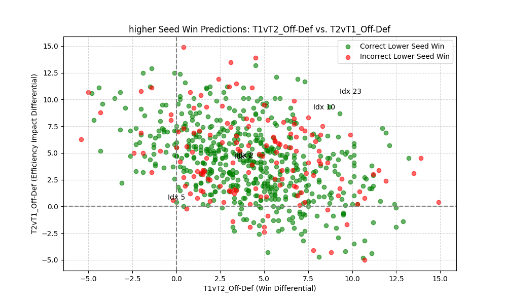
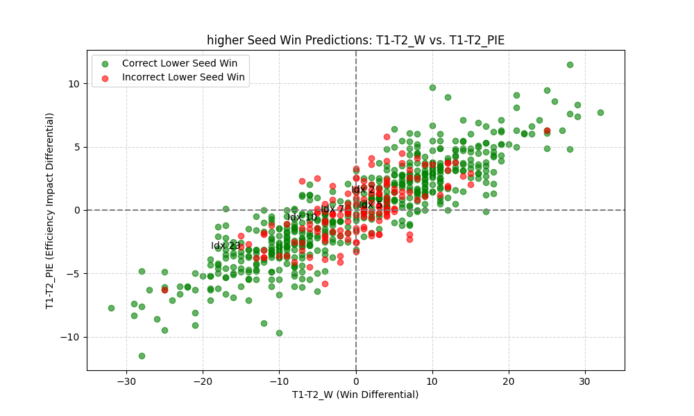

# NBA Playoff Predictor: Results Showcase

## Overview
The NBA Playoff Predictor leverages machine learning to forecast NBA playoff series outcomes. A TensorFlow neural network, trained on advanced team statistics (e.g., NetRtg, PIE, eFG%) from the 1996–2024 seasons, predicts win probabilities for 2025 playoff matchups. Monte Carlo simulations, run thousands of times per series, estimate each team’s probability of advancing through each playoff round. The model achieves 73.3% accuracy for individual series outcomes on historical test data. This document highlights key results and visualizations, complementing the technical details in the [README](README.md).

## Visualizations
Below are key visualizations, created with Tableau and Python, to interpret the model’s predictions and explore patterns in playoff outcomes. 

### 1. 2025 Round Advancement Probabilities
This visual illustrates each team’s probability of advancing past each round of the 2025 NBA playoffs, derived from model predictions and Monte Carlo simulations.

**Takeaways**: - A Western Conference team won the championship in 53.6% of simulations
               - The Memphis Grizzlies have the 4th highest championship odds in the west despite having the 7th highest odds to advance past the first round. Thus an interpretation of this result could be that the model views the Grizzlies as a strong darkhorse candidate if they are to beat the Thunder in the first round.
               - In the Western Conference the deviation in championship winning percentages is far smaller than that of the Eastern Conference. Thus, reflecting superior competition in the West.               
 
### 2. Lower Seed Win Predictions (Upsets)
These scatter plots assess the model’s success in predicting upsets (lower seed wins). Each dot represents a playoff series where the model predicted an upset (green = correct, red = incorrect). The plots analyze four model features:
- **T1vT2_Off-Def**: Team 1’s offensive rating minus Team 2’s defensive rating.
- **T2vT1_Off-Def**: Team 2’s offensive rating minus Team 1’s defensive rating.
- **T1-T2_W**: Difference in regular-season wins.
- **T1-T2_PIE**: Difference in Player Impact Estimate. Note: The PIE (Player Impact Estimate), of a team instead of an individual player, measures a team’s overall statistical contribution; see the [NBA Stats FAQ](https://www.nba.com/stats/help/faq) for details.

**Takeaways**: The even distribution of green and red dots suggests no clear pattern in model upset predictions based on offensive-defensive rating differences. Small clusters of correct and incorrect predictions hint at localized trends, but more data is needed for definitive insights.

**Takeaways**: The spread of dots shows no distinct pattern in upset predictions based on wins and PIE differences, similar to the OffvDef plot. Additional data could reveal subtle trends in model behavior.

### 3. Higher Seed Win Predictions (Non-Upsets)
These scatter plots evaluate the model’s success in predicting non-upsets (higher seed wins). Each dot represents a series where the model predicted a higher seed win (green = correct, red = incorrect).

**Takeaways**: Incorrect predictions (red dots) are interspersed among correct ones, indicating no clear pattern in mispredictions based on offensive-defensive rating differences. Some clustering suggests potential trends, but further data is required for confirmation.

**Takeaways**: The model performs strongly when differences in wins and PIE are large, with incorrect predictions (red dots) clustering near the origin (small differences). This confirms that higher seeds with significant statistical advantages are more predictable winners.

## Conclusion
The NBA Playoff Predictor achieves robust playoff forecasts (73.3% accuracy) using advanced stats from 1996–2024 and Monte Carlo simulations. Visualizations highlight the model’s strength in predicting higher seed wins with large performance gaps, while upset predictions remain less patterned.
